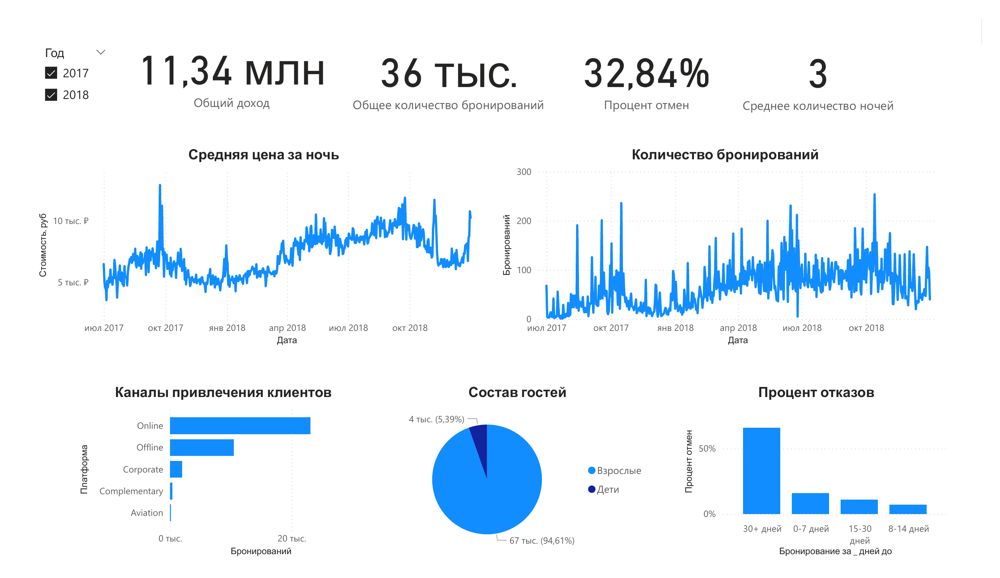
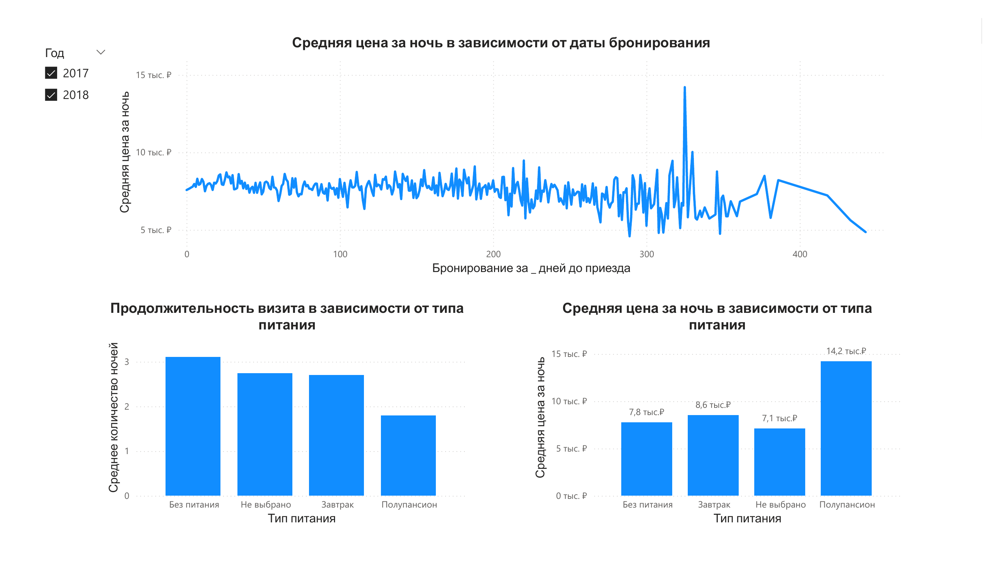

# Аналитика Бронирования Отелей в Power BI

## 📌 Описание проекта

Проект представляет собой аналитический отчёт в Power BI на тему **"Управление бронированием отеля"**. Цель — визуализировать ключевые показатели бизнеса, выявить закономерности и провести углублённый анализ бронирований на основе реальных данных.

Выполнила: Калмыкова М.А.  
Группа: МИВТ-24-3-1

## 🧾 Предметная область

В рамках проекта анализируются следующие аспекты:

- 💸 **Общие показатели бизнеса**  
  Доход, количество бронирований, процент отмен

- 🕒 **Анализ стоимости номеров и количества бронирований во времени**

- 🌐 **Анализ каналов привлечения клиентов**

- 👥 **Анализ состава гостей**  
  В разрезе: взрослые / дети

- ⏳ **Анализ взаимосвязи между отказом от бронирования и временем, оставшимся до даты заезда**

- 🍴 **Анализ влияния типа питания на цену и продолжительность пребывания в отеле**


## 🧾 Используемые файлы

| Файл | Описание |
|------|----------|
| `Hotel.csv` | Основной датасет с информацией о бронированиях |
| `meal.txt` | Дополнительные сведения по типам питания |
| `RC_F01_01_2017_T31_12_2018.xlsx` | Курс евро к рублю по данным ЦБ РФ за 2017–2018 годы |

Источник данных: [Kaggle — Hotel Booking Demand](https://www.kaggle.com/datasets/ahmedwaelnasef/hotel-booking/data)

## 🧠 Вычисляемые столбцы

### Цена в рублях

```DAX
Цена = 
VAR exchangeRate =
  LOOKUPVALUE(
    CourseEuro[curs],
    CourseEuro[data], 'Hotel'[Date]
  )
RETURN 
  'Hotel'[avg_room_price] * exchangeRate
````

### Группировка по дню заезда

```DAX
Дней до = 
SWITCH(
  TRUE(),
  Hotel[lead_time] <= 7, "0-7 дней",
  Hotel[lead_time] <= 14, "8-14 дней",
  Hotel[lead_time] <= 30, "15-30 дней",
  "30+ дней"
)
```

---

## 🧮 Меры (Measures)

* **Общее количество бронирований**

```DAX
COUNT(Hotel[ID])
```

* **Общий доход**

```DAX
SUMX(
  'Hotel',
  'Hotel'[avg_room_price] * 'Hotel'[nights]
)
```

* **Процент отмен**

```DAX
DIVIDE(
  CALCULATE(COUNT(Hotel[ID]), Hotel[status] = "Canceled"),
  COUNT(Hotel[ID])
)
```

* **Среднее количество ночей**

```DAX
AVERAGE(Hotel[nights])
```


## 📷 Скриншоты
### Страница 1

### Страница 2


---
*P.S. Подробнее смотри в pdf-файле*
